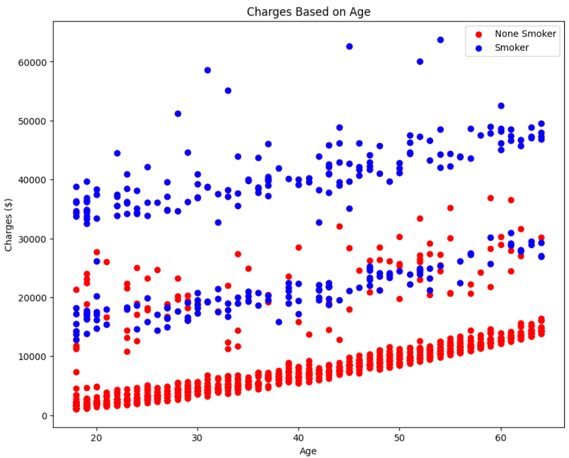
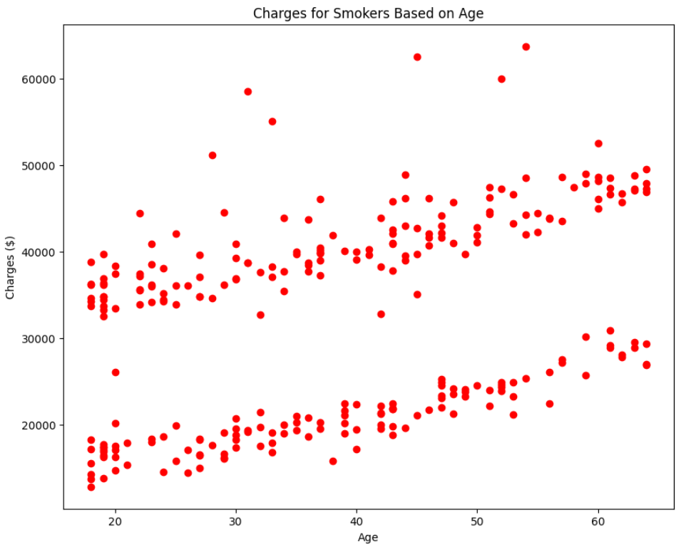

# Health Insurance Prediction Project

This repository focuses on analysing a data set containing information about health insurance premium charges. The primary goal is to develop a regression model which could be used to predict insurance charges for future clients.

To develop the machine learning model, the trends in the data had to be understood so it could be effectively cleaned. 

The main libraries used in this project are Pandas and Scikit-Learn.

To aid with the visual understanding of the client information, a Power BI Dashboard is used to present general information about clients

## Project Overview

### Initial inspection of data

The following data table shows the first few rows of information from this data set:

| age | sex    | bmi   | children | smoker | region    | charges     |
| --- | ------ | ----- | -------- | ------ | --------- | ----------- |
| 19  | female | 27.900| 0        | yes    | southwest | 16884.92400 |
| 18  | male   | 33.770| 1        | no     | southeast | 1725.55230  |
| 28  | male   | 33.000| 3        | no     | southeast | 4449.46200  |

 
The only column with ambiguous data is region. 
 
Unique values in region: 
Southwest  
Southeast 
Northwest  
Northeast 
 
This dataset is for the US and these are geographical regions  
 

___

Description of each column:

| Attribute | Description          |
| --------- | -------------------- |
| age       | Age of the client    |
| sex       | Sex of the client |
| bmi       | Body Mass Index      |
| children  | Number of children   |
| smoker    | Smoking status       |
| region    | Geographic region    |
| charges   | Insurance charges    |

___

With the information in the data set understood, it can be one hot encoded so that it is all numerical. This makes analysis easier:

| age | bmi   | children | charges     | sex_male | smoker_yes | region_northeast | region_northwest | region_southeast | region_southwest |
| --- | ----- | -------- | ----------- | -------- | ---------- | ---------------- | ---------------- | ---------------- | ---------------- |
| 19  | 27.900| 0        | 16884.92400 | 0        | 1          | 0                | 0                | 0                | 1                |
| 18  | 33.770| 1        | 1725.55230  | 1        | 0          | 0                | 0                | 1                | 0                |
| 28  | 33.000| 3        | 4449.46200  | 1        | 0          | 0                | 0                | 1                | 0                |

___

 

### Exploration of data by region

The following table shows the average client from each region.

| Feature           | NE            | NW            | SE            | SW            |
| ----------------- | ------------- | ------------- | ------------- | ------------- |
| age               | 39.268519     | 39.196923     | 38.939560     | 39.455385     |
| bmi               | 29.173503     | 29.199785     | 33.355989     | 30.596615     |
| children          | 1.046296      | 1.147692      | 1.049451      | 1.141538      |
| charges           | 13406.384516  | 12417.575374  | 14735.411438  | 12346.937377  |
| sex_male          | 0.503086      | 0.495385      | 0.519231      | 0.501538      |
| smoker_yes        | 0.206790      | 0.178462      | 0.250000      | 0.178462      |
| region_northeast  | 1.000000      | 0.000000      | 0.000000      | 0.000000      |
| region_northwest  | 0.000000      | 1.000000      | 0.000000      | 0.000000      |
| region_southeast  | 0.000000      | 0.000000      | 1.000000      | 0.000000      |
| region_southwest  | 0.000000      | 0.000000      | 1.000000      | 1.000000      |

From the table above, it is clear that there is some minor deviation in the clients from each of the US regions, but they are mostly similar. This is useful information when analysing outliers because it means that it is unlikely that the region would have significant effect on the deviation of data.

___

 

### Exploration of data by sex

From a general assumption, it is obvious that smoking would have a significant effect on premium charges. For the following basic analysis of the data, smokers are removed.

Average features by sex:

| Feature            | Mean Male Features | Mean Female Features |
| ------------------ | -----------------  | -------------------  |
| age                | 38.935039          | 39.651376            |
| bmi                | 30.614498          | 30.514220            |
| children           | 1.096457           | 1.086239             |
| charges            | 7924.112703        | 8712.630391          |
| sex_male           | 1.000000           | 0.000000             |
| smoker_yes         | 0.000000           | 0.000000             |
| region_northeast   | 0.242126           | 0.240367             |
| region_northwest   | 0.255906           | 0.247706             |
| region_southeast   | 0.253937           | 0.255046             |
| region_southwest   | 0.248031           | 0.256881             |

The average male client is very similar to the average female client for most of the features. However, the charges for women are slightly higher than for men.

Other feature trends are explored in the following sections.

___

 

# Inspection of General Trends

A correlation matrix can be used to check which trends stand out so that they can be focused on.

From the plot above it is clear that the strongest correlation is between smoking and insurance charges. 
There also appear to be weaker trends between bmi, age and charges.
 

---

A scatter matrix can be used to quickly visually inspect trends

The scatter matrix confirms the initial observation from the correlation matrix. It is also clear that there is the strongest trend age and charges.

# Inspection of Specific Trends

The following visualisation shows a scatter of age vs charges, split by the clients smoking status:

From visual inspection it is clear that there is a strong trend for non smokers.
For smokers there appear to be 2 weaker individual trend lines. The following section will explore reasons for this.

# Analysing Charges for Smokers

A plot of age vs charges for just smokers can confirm the previously made observation. There appear to be two trend lines in the data:

For further analysis the data is split using K clustering; using 2 clusters:

The 2 clusters can be generally compared by checking their mean values:

| Feature           | High Smoker Means | Low Smoker Means |
| ----------------- | ----------------- | ---------------- |
| age               | 39.060000         | 37.854839        |
| bmi               | 35.131900         | 25.357500        |
| children          | 1.100000          | 1.129032         |
| charges           | 41437.189068      | 20695.041627     |
| sex_male          | 0.646667          | 0.500000         |
| smoker_yes        | 1.000000          | 1.000000         |
| region_northeast  | 0.206667          | 0.290323         |
| region_northwest  | 0.166667          | 0.266129         |
| region_southeast  | 0.393333          | 0.258065         |
| region_southwest  | 0.233333          | 0.185484         |

The biggest difference between the two clusters is BMI:

From the plot above, it can be observed that for a client with the following conditions:
- BMI greater than 30
- Smoker 

The premium charge is a minimum of $31000.

A plot of BMI vs charges for non smokers shows that this trend only applies to smokers.

# Cleaning Data For Smokers

To allow accurate training of a regression model, the data needs to be clean from outliers. This section justifies how and why certain data points were removed as outliers. Some outliers, even though not results of erroneous nature, had to be removed as they would skew the regression model.

The following visualisation shows the initially observed outliers that should be removed:

The normal distribution can be used to help clean the data. Different numbers of standard deviations are used to experiment with the threshold that should be used to filter the data:

From the plot of the different standard deviation thresholds, it is clear that using thw normal distribution is not the best method to clean the data as either not enough data is removed (2 standard deviations) or too much data is removed (1.4 standard deviations)

The outliers can be  isolated manually by using conditional statements (e.g., BMI< 30 & charges > 30000)

### Exploring the cause of the outliers

Comparing the means of the outliers and their nearest clusters:

| Feature            | Low Smoker Means | Low Outlier Means | High Smoker Means | High Outlier Means |
| ------------------ | ---------------- | ----------------- | ----------------- | ----------------- |
| age                | 37.854839        | 38.000000        | 39.060000        | 42.428571        |
| bmi                | 25.357500        | 25.223333        | 35.131900        | 38.751429        |
| children           | 1.129032         | 1.000000         | 1.100000         | 0.714286         |
| charges            | 20695.041627     | 35302.310893     | 41437.189068     | 56740.486319     |
| sex_male           | 0.500000         | 0.833333         | 0.646667         | 0.571429         |
| smoker_yes         | 1.000000         | 1.000000         | 1.000000         | 1.000000         |
| region_northeast   | 0.290323         | 0.333333         | 0.206667         | 0.142857         |
| region_northwest   | 0.266129         | 0.333333         | 0.166667         | 0.285714         |
| region_southeast   | 0.258065         | 0.166667         | 0.393333         | 0.428571         |
| region_southwest   | 0.185484         | 0.166667         | 0.233333         | 0.142857         |

From the table it isn't clear as to what the causes of the outliers are. Most of the values are close to each other, but the outliers just have higher charges.

To visually inspect the causes of the outliers, gradients of different features can be plot with BMI vs charges:

For both clusters, the general trend is that with age the charges increase, *including the bump when bmi>30.* 
There doesn't appear to be a strong trend between the number of children and charges.

The outliers don't appear to be caused by age or number of children

The previously isolated outliers can be dropped as they don't appear to be caused by the features in this data set. They could however have been caused by other features, such as number of previous claims, that are not mentioned in this data set.

# Cleaning Data For Non Smokers

The charges for non smokers seem to have many outliers away from the general trend. These are isolated by filtering the data set using conditional statements.

### Exploring the Cause of the Outliers

Comparing the means of the outliers and the trend data:

| Features           | Trend Data        | Outlier Data      |
| ------------------ | ----------------- | ----------------- |
| age                | 39.401460         | 38.329787         |
| bmi                | 30.488545         | 31.318085         |
| children           | 1.078206          | 1.223404          |
| charges            | 7047.818367       | 21435.904277      |
| sex_male           | 0.483837          | 0.468085          |
| smoker_yes         | 0.000000          | 0.000000          |
| region_northeast   | 0.234619          | 0.308511          |
| region_northwest   | 0.255474          | 0.212766          |
| region_southeast   | 0.250261          | 0.297872          |
| region_southwest   | 0.259645          | 0.180851          |

From the table it isn't clear as to what the causes of the outliers are. Most of the values are close to each other, but the outliers just have higher charges.

To visually inspect the causes of the outliers, gradients of different features can be plot with BMI vs charges:

The general trend is that charges are higher for clients with more children for the "main trend data", but this isn't represented in the outliers.
There doesn't appear to be a strong trend between BMI and charges

As before, the isolated outliers can be dropped as they don't appear to be caused by the features in this data set. They could however have been caused by other features, such as number of previous claims, that are not mentioned in this data set.

# Clean Data

### Summary of Main Observations

-Charges are higher for smokers

-BMI has little effect on the charges for non smokers

-Charges significantly increase for smokers with BMI > 30

-Charges for clients with more children are higher

-Charges for women are slightly higher than for men

# Fitting a Regression Model to Predict Values of Premium Charges

Key techniques used:

-Scaling to put data in a similar range of magnitude

-Using training and test data sets to optimize the model performance

-Creating polynomial features to improve fit.

-Choosing an optimal degree of polynomial by minimizing mean squared error

-Measuring "goodness" of fit through the use of R2 score.

-Regularization was experimented with but not implemented as it did not improve the accuracy of the model

### Model results
____
The regression model for the clean test data set produces an R2 score of: 0.98

The percentage average accuracy of the model is 92.5%
 
____
 

For the raw test data, the regression model produces an R2 score of 0.82

The percentage average accuracy of the model is 65.5%
___

## Conclusion

This repository successfully analyses a data set on health insurance premiums and explores the general trends. The data was cleaned so that a machine learning model could be developed. Premium prices can be predicted with an average accuracy of 92.5%
